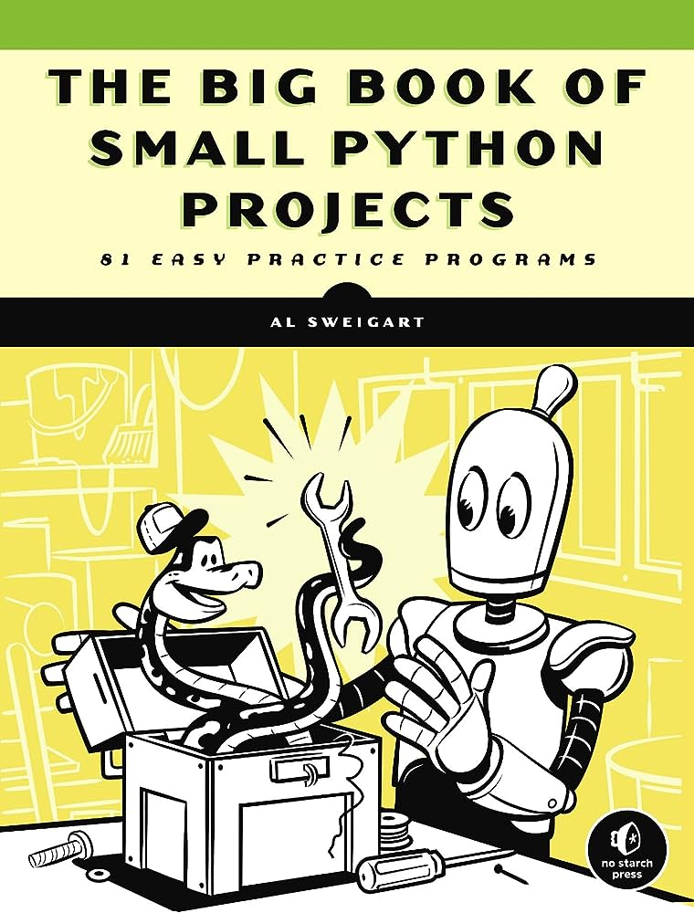

# Python Projects

 

I'm gonna use this repository to
 store my python projects and to help me keep track of my studies.

The book that I'm following is called "The Big Book of Small Python Projects". There's actually two reasons for that:

1. Is the one I've been recommended the most

2. It focuses on improving your problem-solving skills and logical thinking rather than teach you step by step how to do it. Also it gives you several challenges and lots of questions to test your understanding of the solution, such as "Why did that happen?" or "If we change this for that, does it still work?"

Most of the codes are written by me, several of them will look a lot like the ones in the book because I'm using them as reference and, of course, for studying purposes, but be aware that it'll have a lot of comments and some unnecessary-ish lines of code just so I can better understand each block.

If you want the official solutions from the book, you can access it for free under a Creative Commons license at: https://inventwithpython.com/bigbookpython/